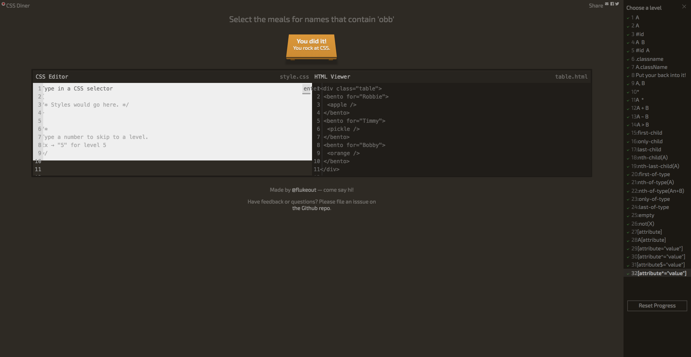

# CSS

HTML의 본질은 '정보', CSS의 본질은 '디자인' 이다.

## 선택자와 선언

## 선택자의 종류

- tag 선택자 
- class 선택자
- id 선택자 
- *(전체) 선택자
- Attribute 선택자

---
## 추천검색어 CSS Cheatsheet Selector

## CSS Diner 선택자 학습 게임
http://flukeout.github.io/

---

## 가상 클래스 선택자의 종류
:link - 방문한 적이 없는 링크
:visited - 방문한 적이 있는 링크
:hover - 마우스를 롤오버 했을 때 
:active - 마우스를 클릭했을 때 
:focus - 키보드 'tap'로 초점을 맞췄을 때 

## 가상 클래스의 property 권장순서
1. color
2. background-color
3. border-color
4. outline-color
5. The color parts of the fill and stroke properties

---

## CSS Diner Game

http://flukeout.github.io/

---

# 'CSS Property'를 공부하는 방법 

---

# CSS Property - Typography

## Font-Size 
- rem (권장)
- epx
- em

rem
html 태그의 폰트 크기에 따라서 상대적으로 크기가 결정된다. 사용자가 글자 크기를 본인의 취향과 필요에 맞춰 변경 할 수 있다. 가장 권장되는 폰트 사이즈 단위 중 하나이다.

px
이미지를 구성하는 최소 단위로서 '점'을 의미하고 '도트(Dot)'라고 부르기도 한다. 고정된 값으로 사용자가 글꼴의 크기를 조정할 수 없다.

em
부모 태그의 영향을 받아 상대적으로 크기가 결정된다. 부모 태그의 글자 크기에 따라서 변하기 때문에 파악하기 어렵다. rem의 등장으로 이 단위의 사용이 권장되지 않는다. 

---

## Color

https://www.w3schools.com/css/css_colors.asp

-rgb (Truecolor)
-hexadecimal (16진수 방식 #000000)
-color (ex tomato, red, blue, black ...)

## Text-align

align: 문서를 작성할 때 문자열을 오른쪽, 중앙, 왼쪽 가운데 어느 한쪽을 기준으로 하여 맞추는 것

---