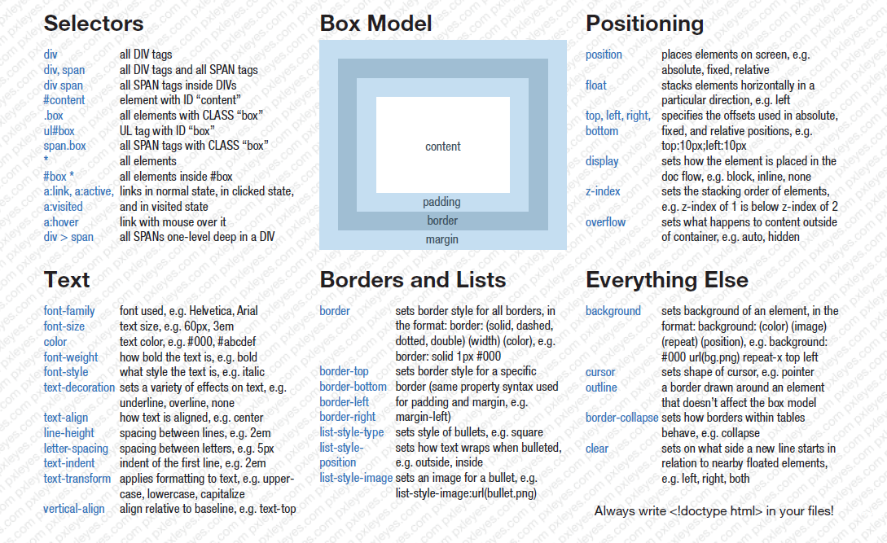

# CSS

HTML의 본질은 '정보', CSS의 본질은 '디자인' 이다.

## 선택자와 선언

## 선택자의 종류

- tag 선택자 
- class 선택자
- id 선택자 
- *(전체) 선택자
- Attribute 선택자

---
## 추천검색어 CSS Cheatsheet Selector

## CSS Diner 선택자 학습 게임
http://flukeout.github.io/

---

## 가상 클래스 선택자의 종류
:link - 방문한 적이 없는 링크
:visited - 방문한 적이 있는 링크
:hover - 마우스를 롤오버 했을 때 
:active - 마우스를 클릭했을 때 
:focus - 키보드 'tap'로 초점을 맞췄을 때 

## 가상 클래스의 property 권장순서
1. color
2. background-color
3. border-color
4. outline-color
5. The color parts of the fill and stroke properties

---

## CSS Diner Game

http://flukeout.github.io/

