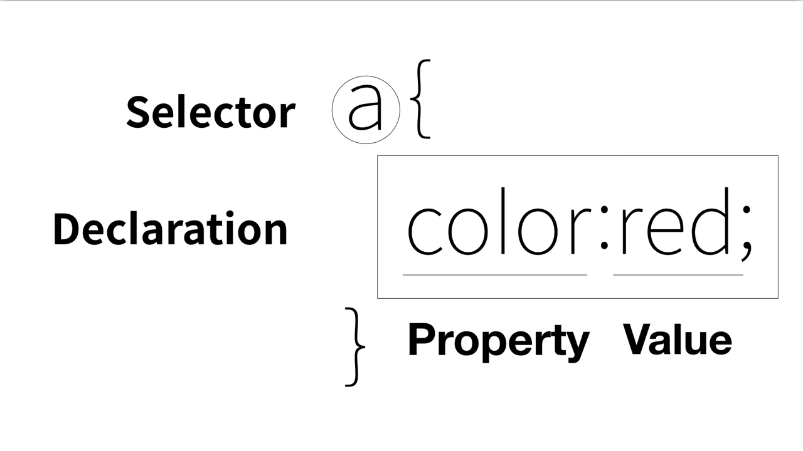
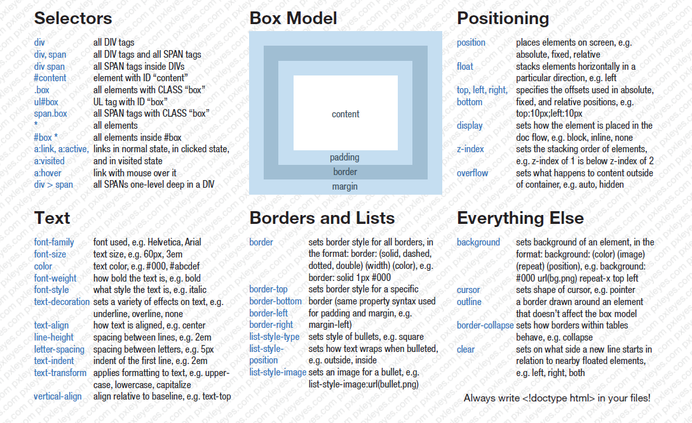
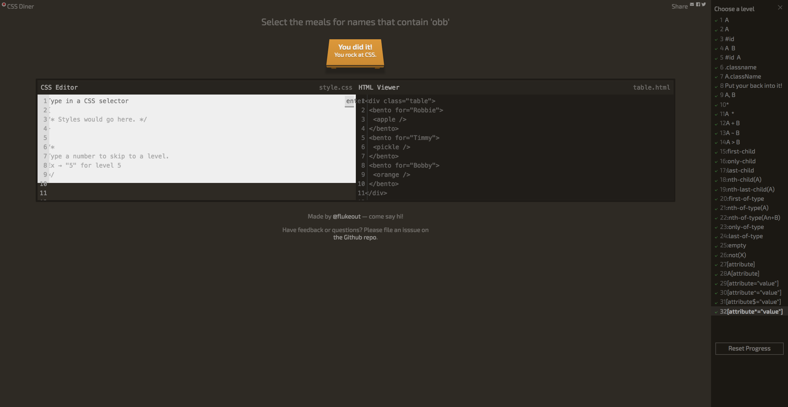

# CSS

HTML의 본질은 '정보', CSS의 본질은 '디자인' 이다.

HTML은 정보를 생산, 보관, 전송을 위해 전자출판을 하기 위한 언어라고 할 수 있다.

HTML은 정보를 어떻게 잘 표현하는가가 중요하다.


## 선택자(selector)와 선언(declaration)



```css
h1{color: red; font-size: 12px;}
```

```
Property
Value
Valeue-property separator
Declearation separator
```

## 선택자의 종류

- tag selector
- class selector
- id selector 
- *(전체) selector
- attribute selector

```css
ul li{
  color: red;
}
ul>li{
  color: blue;
}
```

```css
ul>li{
  color: blue;
}
ul li{
  color: red;
}
```

> 무슨 차이인가?

- pseudo class selector
  - :link
    - 방문한 적이 없는 링크
  - :visited
    - 방문한 적이 있는 링크
  - :hover
    - 마우스를 롤오버 했을 때
  - :active
    - 마우스를 클릭 했을 때

---
## 추천검색어 CSS Cheatsheet Selector


## CSS Diner 선택자 학습 게임
http://flukeout.github.io/

---

## 가상 클래스 선택자의 종류
:link - 방문한 적이 없는 링크
:visited - 방문한 적이 있는 링크
:hover - 마우스를 롤오버 했을 때 
:active - 마우스를 클릭했을 때 
:focus - 키보드 'tap'로 초점을 맞췄을 때 

## 가상 클래스의 property 권장순서
1. color
2. background-color
3. border-color
4. outline-color
5. The color parts of the fill and stroke properties

---

## CSS Diner Game

http://flukeout.github.io/


---

# CSS Property - Typography

## Font-Size 
- rem (권장)
- epx
- em

rem
html 태그의 폰트 크기에 따라서 상대적으로 크기가 결정된다. 사용자가 글자 크기를 본인의 취향과 필요에 맞춰 변경 할 수 있다. 가장 권장되는 폰트 사이즈 단위 중 하나이다.

px
이미지를 구성하는 최소 단위로서 '점'을 의미하고 '도트(Dot)'라고 부르기도 한다. 고정된 값으로 사용자가 글꼴의 크기를 조정할 수 없다.

em
부모 태그의 영향을 받아 상대적으로 크기가 결정된다. 부모 태그의 글자 크기에 따라서 변하기 때문에 파악하기 어렵다. rem의 등장으로 이 단위의 사용이 권장되지 않는다. 

---

## Color

https://www.w3schools.com/css/css_colors.asp

-rgb (Truecolor)
-hexadecimal (16진수 방식 #000000)
-color (ex tomato, red, blue, black ...)

## Text-align

align: 문서를 작성할 때 문자열을 오른쪽, 중앙, 왼쪽 가운데 어느 한쪽을 기준으로 하여 맞추는 것

---

## Font-family: 서체를 지정한다.

- serif (획의 일부 끝이 돌출된 형태를 가진 글씨체)
- sans-serif (획에 삐침이 없는 글씨체:고딕체)
- cursive (흘림체)
- fantasy
- monospace (고정폭)

## font-weight: 서체의 두께

## line-height: 자간

## font: font-style font-variant font-weight font-size/line-height font-family|caption|icon|menu|message-box|small-caption|status-bar|initial|inherit; 

---

## 서체
서체는 크게 가변폭과 고정폭으로 구분된다.

## Sans serif
- sans 는 '~이 아니다.' 라는 뜻을 가지고 있습니다.
- serif 는 '글꼴에서 사용되는 장식(삐침)을 의미합니다.

## Font Ranking  
http://www.fontreach.com/#top

## Naver Font 
http://software.naver.com/software/fontList.nhn?categoryId=I0000000#brandId=

---

## Web Font

사용자가 가지고 있지 않은 폰트를 웹페이지에서 사용할 수 있는 방법입니다.

## Google Font
https://fonts.google.com/?authuser=1

## Web-Font-Generator
https://www.web-font-generator.com/

---

상속은 부모 엘리먼트의 속성을 자식 엘리먼트가 물려받는 것을 의미합니다. 
상속은 CSS에서 생산성을 높이기 위한 중요한 기능이다
https://www.w3.org/TR/CSS21/propidx.html

---

stackoverflow
https://stackoverflow.com/

stylish
https://userstyles.org/

---

# Cascading

CSS는 Cascading Style Sheet의 약자입니다. Cascading은 CSS의 첫번째 글자로 등장할만큼 가장 중요한 기능 다시 말해 철학이라는 의미가 있습니다. Cascading을 사전에서 찾아보면 폭포라는 의미가 있습니다. 즉 웹페이지의 디자인이 웹브라우저의 기본 디자인과 브라우저 사용자의 디자인 그리고 웹페이지 저자의 디자인이 결합될 수 있다는 점에 착안하고 있다고 할 수 있습니다.

즉 웹브라우저, 사용자, 컨텐츠 생산자의 조화를 중요한 철학으로 삼고 있다고 생각됩니다. 여기서는 하나의 엘리먼트에 대해서 다양한 효과가 영향력을 행사하려고 할 때 우선순위를 어떻게 설정하는가에 대한 규칙을 '캐스캐이딩'이라고 한다.

---

# 우선순위
1. 저자
2. 사용자
3. 웹브라우져

# Cascading 우선순위
1. style attribute
2. id selector
3. class selector
4. tag selector

!important; /Cascading 우선순위에 관계없이, 최우선순위가 된다.

----

# Brackets

[Brackets](http://brackets.io/)

# Emmet
[Emmet](https://docs.emmet.io/)
div>ul>li
div+p+bq

---
# layout

정보를 잘 정리 정돈해서 일관된 모습으로 보여지도록 하는 것은 디자인에서 매우 중요한 주제입니다. 구획을 나누고 적절히 정보를 배치하는 것을 레이아웃(layout)이라고 합니다. 안타깝게도 CSS를 이용해서 레이아웃을 잡는 것은 다소 어려운 것이 사실입니다. 하위 토픽에서는 레이아웃을 잡기 위해서 필요한 기본적인 개념들을 알아보고 실제로 사용하는 모습도 살펴보겠습니다.

- inline element VS block level element 
- boxmodel
- 마진겹침 현상
- 포지션
- float

---
## block level element (block level tag)

## inline level element

---

## Box Model
- margin
- border
- pedding
>- margin>border>pedding>content에 위치합니다.
>- content 가 차지하는 공간을 'content-box'라고 합니다. 
>- content-box는 width와 height를 사용해 변경 할 수 있습니다. 
---
## Box-sizing

box-sizing은 박스의 크기를 화면에 표시하는 방식을 변경하는 속성입니다.
box-sizing을 지정하지 않았을 때 초기값은 content-box입니다. 
width와 height는 엘리먼트의 컨텐츠의 크기를 지정합니다. 따라서 테두리가 있는 경우에는 테두리의 두께로 인해서 원하는 크기를 직관적으로 파악하기 어렵습니다. box-sizing 속성을 border-box로 지정하면  테두리를 포함한 크기를 지정할 수 있기 때문에 예측하기가 더 쉽습니다. 최근엔 모든 엘리먼트에 이 값을 지정하는 추세입니다.

---
## margin-collapsing 

마진겹침(margin-collapsing) 현상은 상하 마진값이 어떤 상황에서 사라지는 현상을 의미합니다.
sibling (형제관계 element:동등한관계), parents child (부모-자식관계 element:상하관계)

1. sibling elements 의 마진이 중첩 될 때, 둘 중 마진이 큰 값이 둘 사이의 마진이 된다.
2. elements 의 마진이 중첩되고, 둘중 하나의 element 의 시각적 요소가 없어지면, 중첩된 마진 값 중 큰 값이 마진으로 적용된다.
3. parents-child element 에서 parents element 의 시각적 요소가 없어지면, 둘 중 마진이 큰 값이 child element의 마진으로 적용된다.

---

# Position
position은 'html element(tag+content)' 들이 화면상에 어디에 위치할 것인가를 결정하는 주제입니다. box-model이 element ~ element의 간격과 부피감을 결정하는 주제였다면, position은 각각의 element의 위치를 결정하는 것과 관련된 주제입니다.

- static (default) : 위치와 관련된 값을 설정을 하지 않은 상태의 기본값
- relative : (offset) 위치와 관련된 값을 설정 할 수 있는 상태
- absolute : 시각적으로 'parents-child' 관계가 끊기기 때문에, absolute 를 지정한 element의 부피는 자신의 content 크기 만해지고 'parents element'는 'child element'를 자신의 부피에 포함시키지 않는다. 절대적인 위치를 지정 할 수 있다.
- fixed : 시각적으로 'parents-child' 관계가 끊기기 때문에, absolute 를 지정한 element의 부피는 자신의 content 크기 만해지고 'parents element'는 'child element'를 자신의 부피에 포함시키지 않는다. 스크롤과 관계없이 화면에 고정된다.

---

# offset

컴퓨터 과학에서 배열이나 자료 구조 오브젝트 내의 오프셋(offset)은 일반적으로 동일 오브젝트 안에서 오브젝트 처음부터 주어진 요소나 지점까지의 <strong>변위차를 나타내는 정수형</strong>이다. 

이를테면, 문자 A의 배열이 abcdef를 포함한다면 'c' 문자는 A 시작점에서 2의 오프셋을 지닌다고 할 수 있다. 어셈블리어와 같은 저급 프로그래밍 언어에서 오프셋은 상대 주소(relative address)로 부른다.
top > bottom (top과 bottom 중 top이 우선순위이다.)
left > right (left와 right 중 right가 우선순위이다.)

---

# relative : parent element를 기준으로 상대적으로 left top right bottom 위치값을 지정할 수 있다.

# absolute : 상황에 따라 &lt;html&gt; element를 기준으로 offset(위치값)을 지정해야 할 때 absolute을 사용한다.

---

>## absolute : absolute에 left=0; top=0; 을 지정한 경우,  &lt;html&gt; element를 기준으로 위치값이 지정된다.

>## absolute : absolute에 offset을 지정하지 않은 경우, 'parent element' 의 'content-box'의 바깥 부분에 위치값이 지정된다.
---

>## absolute : absolute를 지정하게 되면, 'parents' element에 영향을 받지 않고 offset 위치값이 지정되게 된다. (상위 레이어로 지정된다.) 

>## absolute : position: type (static을 제외한) 이 'parents element'에 지정된 경우, 그 값을 기준으로 offset이 지정된다.

---
# fixed

>## fixed : width 와 height 를 지정하지 않으면 content-box 크기가 된다. 

>## fixed : fixed elements의 'parents element'는 fixed를 지정하는 순간, 시각적으로 parents-child 관계가 끊기게 된다. 즉 'parents element'는 'child element'의 크기를 포함하지 않는다.

---
# Position

- static (default) : element가 생성된 곳에 위치값이 지정된다.
- relative : (offset) 특정 element를 'parents element'를 기준으로 위치 지정하기 위해 사용한다.
- absolute : &lt; html &gt; element를 (절대값) 기준으로 한 후, offset 값을 설정해 위치를 지정하기 위해 사용한다.
- fixed : absolute와 마찬가지로 'parents element'와 시각적으로 독립되기 때문에 width 와 height를 다시 지정해주어야 한다.

---
## absolute,fixed
>- absolute, fixed 를 설정하면 부피(면적), 위치관계 등 시각적인 정보가 'parents element'로 부터 독립된다.
>  html tag markup 에서 설정한 'parents-child'등을 포함하는 구조적관계가 파괴되고 재정의 되는 것은 아니다.
>  따라서 상속을 포함한 html의 모든 문법은 그대로 적용된다.


>- html(Tag markup) , 구조적인 관계에서 'parents-child'관계에 영향을 미치지 않는다.. CSS (style sheet) , 시각적인 정보에서 'parents-child'관계가 독립된다. 


>- absolute,fixed를 지정할 때 'parents-child' 에 연관된 시각적인 정보 (위치관계)가 독립되는 것을 "layout상에서 위치관계가 끊긴다." 고 표현한 사람도 있었다.

