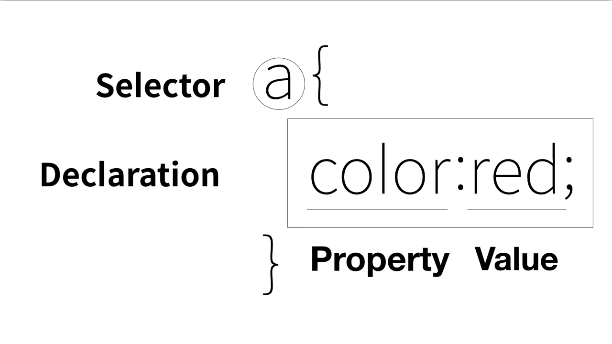

# CSS
기본문법
-

Selector : 선택자 
Declaration : 선언 - 선택자가 지정하는 태그에 어떠한 효과를 줄 것인가?
Property 속성
Value : 속성의 값

Tag 

스타일이라는 속성을 사용하면 속성의 값을 웹브라우져는 css의 문법에 따라 해석해서 그 결과를 스타일이라는 속성을 가지고 있는 Tag에게 적용한다.
스타일이라는 속성은 HTML의 속성이다.
스타일이라는 속성은 그 값으로 반드시 css의 효과가 들어온다.

스타일 이라는 태그는 효과만 있어서는 효과를 누구에게 적용시킬지 알 수 없기 때문에 선택자가 필요하다.

---

---
# 추천검색어
	CSS text size property
    CSS font-size property
    
    CSS text center property
    CSS align-content property 
---
