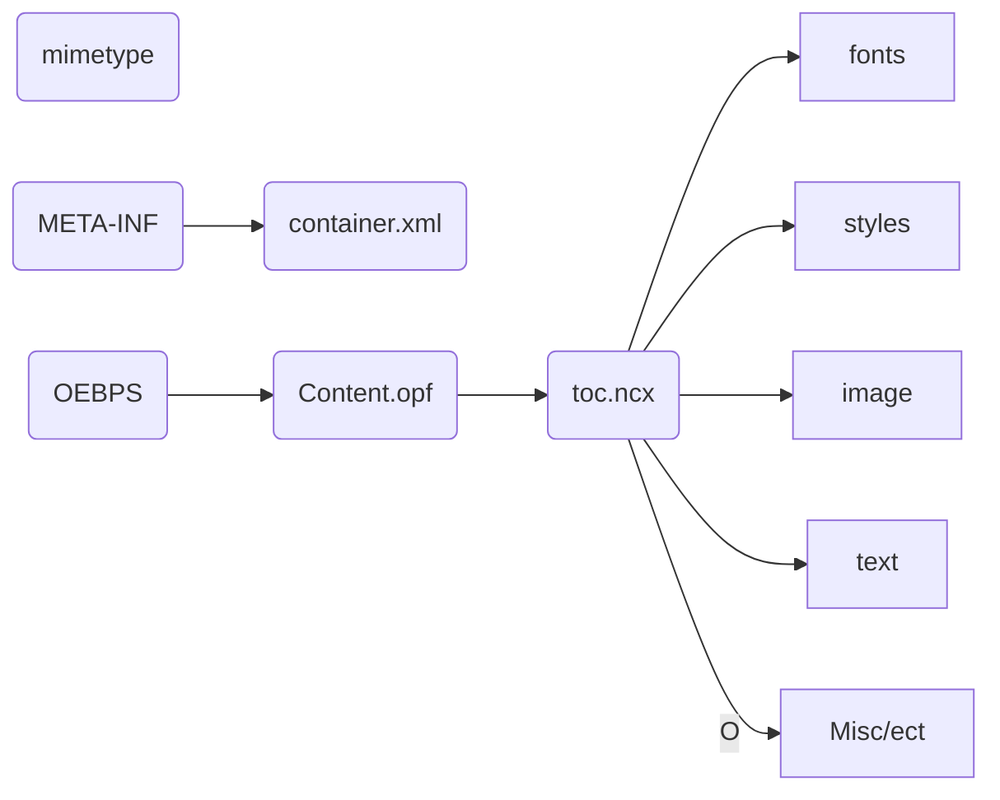

> EPUB(electronic publication)란 무엇인가?

```
EPUB은 국제 디지털 출판 포럼(IDPF, International Digital Publishing Forum)에서 공동으로 제정한 전자서적표준규격이다. EPUB은 자동공간조정(reflowable)이 가능하게 디자인 되었다. 이는 EPUB으로 만들어진 내용을 볼 때 디스플레이하는 기계의 형식, 크기에 자동으로 최적화되어 보여줄 수 있다는 의미이다.
```

> 주요기술

- XHTML5
- SVG1.1
- CSS
- Javascript
- Ture Type
- WOFF
- SSML PLS CSS3 Speech
- XML
- SMIL3

> 주요특징

- 리플로우 레이아웃 (Reflow Layout)
- 고정형 레이아웃 (Fixed Layout)

> epub3 의 4가지 규격

- epub publications 
- epub content Documents 
- epub open container format
- epub media overlay

> epub publications

`제목과 같은 메타 데이터와 내부 콘텐츠의 구성 등을 정의하고, epub 에 포함된 파일들을 구성하기 위한 규격있다.`

- 패키지 도큐먼트 (opf, 필수)
- epub 네비게이션 도큐먼트 (사용자에게 제공되는 목차 xhtml 파일, 필수)
- epub 콘텐츠 도큐먼트 (사용자가 일을 콘텐츠, 필수)
- epub 스타일시트(css 2.1 + css3 일부, 선택)
- 발음 사전 도큐먼트 (선택)

> epub content Documents 

`콘텐츠를 작성할 때 사용되는 리소스들을 정의하고 있다. epub에서 권장하는 데이터의 종류는 코어 미디어 타입이다.`

> epub open container format

`epub 를 하나의 도서 파일로 덩리하기 위한 패키징부분으로, 압축 시 규정이 설명되어 있다.`

- Container.xml (epub 파일 중 가장 먼저 참조 되는 파일, 필수)
- Signatures.xml (전자서명 관련 파일, 선택)
- Encryption.xml (암호화에 관한 파일)
- metadata.xml (메타 데이터, 선택)
- rights.xml (DRM:디지털 저작권 관리 정보, 선택)

> epub media overlay

- `epub에 포함된 텍스트, 동영상, 음성을 동기화 시키는 방법을 규정하고 있다.`

> 1. OPS (Open Publication Structure)
>
> OPS는 콘텐츠 편집에 사용할 수 있는 HTML 태그, CSS, 사용 가능한 미디어 타입(이미지, 동영상, 음성 등) 및 포멧 등을 정의합니다. EPUB을 제작할 때 OPF와 OCF에 있는 내용은 주로 저작 도구가 자동으로 처리해 주는 반면 OPS에 정의된 사항은 편집자가 처리하기 때문에 EPUB에서 발생하는 오류는 주로 이 부분의 규칙을 잘못 적용해서 생깁니다.

> 2. OPF(Open Packaging Format)
>
> OPF는 EPUB 파일 내에 있는 ‘.opf’(파일명은 임의로 지정 가능하나 주로 content.opf로 사용) 파일에 대해 설명한 파일입니다. 이 파일은 EPUB 패키지 내에 어떤 파일들이 들어있고 파일 종류는 무엇인지에 대한 정보를 담고 있습니다. 예를 들어 콘텐츠를 만들 때 ‘cover.jpg’라는 이름으로 표지 이미지와, ‘UnBatang.ttf’를 사용했다면 EPUB 파일 안에 있는 ‘content.opf’ 파일 안에 두개의 파일이 어느 위치에 있으며 각각 어떤 종류인지를 명시해야합니다. 
>
> 이 규칙을 통해 뷰어는 EPUB 콘텐츠 내에 어떤 파일이 어디 있는지를 확인해서 콘텐츠를 열 수 있게 됩니다. 그 외에 목차 정보를 담고 있는 NCX파일과 메타데이터 등 콘텐츠의 기본 골격을 이루는 정보에 대한 요구사항을 담고 있습니다. 
>
> OPF는 주로 뷰어를 개발할 때 참고하는 항목이고, content.opf 파일이나 NCX 파일은 EPUB 저작툴이 자동으로 생성을 하기 때문에 출판 편집자라면 개념만 알고 넘어가도 되는 항목입니다. 

> 3. OCF(Open eBook Publication Structure Container Format)
>
> OCF는 EPUB파일을 만들기 위한 규칙을 담고 있는 파일입니다. EPUB은 하나의 파일처럼 보이지만 압축 파일로 많이 사용하는 ZIP파일 안에 일정한 규칙에 의해 여러개의 이미지, 폰트, 텍스트(html/xhtml)파일 등이 패키지로 압축된 파일입니다. OCF는 여러개의 파일을 ZIP파일로 압축할 때 필요한 규칙을 정리하고 있습니다. 
>
> OCF 역시 뷰어나 저작 도구를 개발할 때 참고하는 항목으로 EPUB 저작 도구는 이 규칙을 기준으로 해서 편집자가 편집한 콘텐츠를 ‘.epub’을 확장자로 갖는 하나의 파일로 저장합니다. OCF 역시 OPF처럼 기본 개념만 알고 있어도 EPUB을 만드는데 문제가 되지 않습니다. 하지만 EPUB의 기본 구조를 알아두면 EPUB을 제작시 유용하게 활용할 수 있습니다.

> epub publications 구성파일

- Mimetype

  ```/minetype file 의 내용
  application/epub+zip
  ```

  - minetype 은 `epub` 라는 정보를 담고있는 메타데이터 이다. 
  - (epub2 에서는 위의 text가 필수적으로 공백을 비롯한 다른 문자를 허용하지 않는다. 압축X, epub3에서는 제약이 없다.)
  - '' 이런 형식의 정보가 담겨 있어 EPUB 파일이라는 사실을 알리는 역할을 한다. EPUB2.0에서는 위의 텍스트가 필수적이고 공백 등 다른 문자를 허용하지 않는다. 또한 이 파일은 압축을 하면 안되도록 규정되어 있습니다. EPUB3.0에서는 이런 제한이 없다.

- [META-INF}

  - container.xml

    `epub viewer 에게 epub publication의 위치를 알려주는 파일이다. contents rootfile 이라고 불린다.`

    `samlple`.epub의  `root folder` 위치를 알려주고, content.opf 파일의 위치를 지정한다. 

    - container.xml에서 지정된 내용에 따라서 [OEBPS] 폴더 명이 달라질 수 있다. 또한 container.xml에 적혀있는 파일명과 위치에 정확히 content.opf 파일이 존재해야한다. 즉 content.opf 파일명은 container.xml파일의 정보에 따라 변경 될 수 있다. 

  ```html
  <?xml version="1.0" encoding="UTF-8" ?> 
  <container version="1.0" xmlns="urn:oasis:names:tc:opendocument:xmlns:container">
  	<rootfiles>
  		<rootfile full-path="OEBPS/content.opf" media-type="application/oebps-package+xml" /> 
  	</rootfiles>
  </container>
  ```

- [OEBPS] ePub 의 `root folder` 역할을 한다. 실제 콘텐츠가 위치하는 폴더이다.
  - content.opf 모든 파일의 위치와 콘텐츠에 대한 정보를 담고있다. 뷰어가 제일먼저 확인하는 파일로서 저작도구가 자동생성한다.
  - toc.ncx 책의 목차 정보를 담고있다. 저작도구가 자동생성한다.
  - [text]
  - [img]
  - [fonts]
  - [css]




> opf 파일

`unique-identifier` 은 opf 의 필수 입력 항목입니다.

`unique-identifier` 는 GUID 나 ISBN을 사용하는 것을 권장합니다.

`<dc:title>`을 사용해 책 제목을 입력합니다.

`<dc:language>`로 책에 사용된 언어를 설정

`Ko` 언어코드 

`kr` 국가코드

> Epub 스타일

```
1. 표지 스타일
2. 속표지 스타일
3. 목차 스타일
4. 장 제목 스타일
5. 본문 스타일
6. 이미지 스타일
6.1. full-sizeing 스타일
6.2. 좌측 정렬 스타일
6.3. 우측 정렬 스타일
6.4. 중앙 정렬 스타일
6. 괄호 설명
7. 빈병 라벨
8. 시, 인용구
9. 가운데 정렬
10. copyright
```

> Epub 적합성검사 

```
http://Validator.idpf.org/
```

> Sigil

- 표지 스타일 지정

```css
.img_cover {

text-indent : 0; /*div 태그를 쓸 경우 없어도 됨*/

text-align : center;

tidth : 100%;

teight : 100%

}
```

```html
<p class="img_cover"></p>
```

```css
.cover {

width: 100%;

height : 100%;

text-indent : 0;

text-align : center;

 

display: box;

box-orient: horizontal;

box-pack: center;

box-align: center;

 

display: -webkit-box;

-webkit-box-orient: horizontal;

-webkit-box-pack: center;

-webkit-box-align: center;

 

display: -moz-box;

-moz-box-orient: horizontal;

-moz-box-pack: center;

-moz-box-align: center;

}

 

img.cover {

width : 100%;

height : auto;

}
```

```html
<div class="cover"></div>
```

```html
<h1>Alice’s Adventures in Wonderland</h1>
```

```css
{

text-indent:0 !important;

text-align:center;

 

font-size:3em;

font-family: "Times New Roman", Times, serif;

 

display : table;  /* 제목 밑줄*/

border-bottom : solid 1px #000000;

margin : 20% auto 10px auto;

padding-bottom : 10px;

}
```

```html
<h2>이상한 나라의 앨리스</h2>
```

```Css
h2 {

text-indent : 0 !important;

text-align:center;

font-size:1.6em;

font-family:"강조글꼴";

margin : 0 0 15% 0;

}
```

```html
<p class="sub_author">루이스 캐럴</p>
<p class="sub_translator">최지원 옮김</p>
```

```css
.sub_author {

text-align : center;

text-indent : 0 !important;

font-size:1.2em;

font-family:"기본글꼴";

}

 

.sub_translator {

text-align : center;

text-indent : 0 !important;

font-size:0.8em;

font-family:"기본글꼴";

}
```

```html
<p class="logo"></p>
```

```css
.logo {

text-align : center;

text-indent : 0 !important;

}

 

img.logo {

margin-top : 10%;

width : 20%;

max-width : 100%;

}
```

>

```css
text-align : center;

text-indent : 0 !important;

font-family:"기본글꼴";


h2 .sub_author .sub_translator {

text-align : center;

text-indent : 0 !important;

font-family:"기본글꼴";

 

}

 

h2 {

font-size:1.6em;

margin : 0 0 15% 0;

}

 

.sub_author {

font-size:1.2em;

}

 

.sub_translator {

font-size:0.8em;

}
```

> 일반적인 표지

 ```css
 .cover {text-indent : 0;text-align : center;margin : 0;padding : 0;width : 100%;}

 img {width : 100%;margin : 0;padding : 0;}
 ```

 ```html
 <p class="cover"></p>
 ```

> 상하좌우 중앙정렬 표지

```css
div..cover {

width: 100%;

height: 100%;

text-align : center;


display: box;

box-orient: horizontal;

box-pack: center;

box-align: center;


display: -webkit-box;

-webkit-box-orient: horizontal;

-webkit-box-pack: center;

-webkit-box-align: center;


display: -moz-box;

-moz-box-orient: horizontal;

-moz-box-pack: center;

-moz-box-align: center;

}
```

```html
<html>

<head>

<style>

html, body { height : 100%; margin : 0; padding : 0; }

</style>

</head>

<body>

<div class="cover"></div>

</body>

</html>
```

```
3.5.2.1 Container File (container.xml)
The required container.xml file in the META-INF directory identifies the EPUB Packages in the OCF Abstract Container.

The contents of this file must be valid to the schema in Schema for container.xml after removing all elements and attributes from other namespaces (including all attributes and contents of such elements).

Each rootfile element must identify the location of a Package Document representing one Rendition of the EPUB Publication.

An OCF Processor must consider the first rootfile element within the rootfiles element to represent the Default Rendition for the contained EPUB Publication. Reading Systems are required to present the Default Rendition, but may present other Renditions in the container.

The following example shows a sample container.xml for an EPUB Publication with the root file EPUB/My Crazy Life.opf (the Package Document):

<?xml version="1.0"?>
<container version="1.0" xmlns="urn:oasis:names:tc:opendocument:xmlns:container">
    <rootfiles>
        <rootfile full-path="EPUB/My_Crazy_Life.opf"
            media-type="application/oebps-package+xml" />
    </rootfiles>
</container>
                    
The following example shows SVG and XHTML Renditions bundled in the same container:

<?xml version="1.0"?>
<container version="1.0" xmlns="urn:oasis:names:tc:opendocument:xmlns:container">
    <rootfiles>
        <rootfile full-path="SVG/Sandman.opf"
            media-type="application/oebps-package+xml" />
        <rootfile full-path="XHTML/Sandman.opf"
            media-type="application/oebps-package+xml" />
    </rootfiles>
</container>
                    
The optional links element identifies resources necessary for the processing of the OCF ZIP Container. Each of its child link elements must include an href attribute whose value identifies the location of a resource. Each link element also must include a rel attribute whose value identifies the relationship of the resource, and may include a media-type attribute whose value must be a media type [RFC2046] that specifies the type and format of the resource referenced by the link.

The value of the rootfile element full-path attribute and the link element href attribute must contain a path component [RFC3986] which must take the form of a path-rootless [RFC3986] only. The path components are relative to the Root Directory.

OCF Processors must ignore foreign elements and attributes within a container.xml file.
```
```opf
<?xml version="1.0"?>
<package version="3.1" 
         xml:lang="en"
         xmlns="http://www.idpf.org/2007/opf" 
         unique-identifier="pub-id">
    
    <metadata xmlns:dc="http://purl.org/dc/elements/1.1/">
        <dc:identifier 
              id="pub-id">urn:uuid:B9B412F2-CAAD-4A44-B91F-A375068478A0</dc:identifier>
        
        <dc:language>en</dc:language>
        
        <dc:title>As You Like It</dc:title>
        
        <dc:creator id="creator">William Shakespeare</dc:creator>
        
        <meta property="dcterms:modified">2000-03-24T00:00:00Z</meta>
        
        <dc:publisher>Project Gutenberg</dc:publisher>
        
        <dc:date>2000-03-24</dc:date>
        
        <meta property="dcterms:dateCopyrighted">9999-01-01</meta>
        
        <dc:identifier 
              id="isbn13">urn:isbn:9780741014559</dc:identifier>
        
        <dc:identifier id="isbn10">0-7410-1455-6</dc:identifier>
        
        <link rel="xml-signature" 
              href="../META-INF/signatures.xml#AsYouLikeItSignature"/>
    </metadata>
    
    <manifest>
        <item id="r4915" 
              href="book.html" 
              media-type="application/xhtml+xml"/>
        <item id="r7184" 
              href="images/cover.png" 
              media-type="image/png"/>
        <item id="nav" 
              href="nav.html" 
              media-type="application/xhtml+xml" 
              properties="nav"/>
    </manifest>
    
    <spine>
        <itemref idref="r4915"/>
    </spine>
</package>

```

```
.thumbnail_image {
    position: relative;
    width: 200px;
    box-shadow: 0px 2px 6px rgba(0, 0, 0, 0.4);
}

.thumbnail_image::before {
    content: "";
    box-sizing: border-box;
    display: block;
    width: 100%;
    height: 100%;
    position: absolute;
    left: 0px;
    top: 0px;
    background: linear-gradient(to right, rgba(0, 0, 0, 0.2) 0px, transparent 5%, transparent 95%, rgba(0, 0, 0, 0.2) 100%);
}

.thumbnail {
    width: 100%;
    max-height: 313px;
}

.border {
    box-sizing: border-box;
    opacity: 0.2;
    display: block;
    width: 100%;
    height: 100%;
    position: absolute;
    left: 0px;
    top: 0px;
    z-index: 3;
    border: 1px solid #000;
}
```
```기본템플릿
폰트는 책에 따라 항상 바뀐다. 폰트가 더 추가될 수도 있고, 한 두 개의 폰트만 사용할 수도 있다. @font-face로 폰트를 지정할 때 font-family는 사용할 폰트의 목적에 맞게 지정해 주는게 좋다. 많은 편집자들이 font-family 이름을 폰트 파일 명으로 지정하는데 그러다보면 사용하지 않는 폰트가 추가되는 경우도 생기고 폰트가 어디에 사용됐는지 확인하기도 어렵다. 그리고 사용하지 않는 폰트는 CSS에서 삭제해 줘야하고, 시스템 폰트를 @font-face로 지정하려면 속성을 정확히 지정해 주는게 좋다. 아무런 속성 없이 시스템 폰트를 @font-face로 지정하는 편집자도 많은데 불필요한 쓰레기 데이터일 뿐이다. 

/* 폰트 추가 */

@font-face 

	{

		font-family: "본문";

		src: url("../Fonts/UnBatang.ttf"); 

	}


@font-face 

	{

		font-family:"제목"; 

		src: url("../Fonts/NanumGothicBold.ttf");

	}


* 속성은 body태그가 대신하기도 한다. HTML에서는 body 태그가 모든 다른 태그를 감싸고 있기 때문에 특정 스타일이 지정되지 않은 태그에 기본적으로 적용되는 태그이다. * 태그 역시 문서 전체에 영향을 주는 기본 스타일을 지정하는데 사용된다. 필자는 margin과 padding을 0으로 지정했지만 text-indent :1em; text-align :justify;등의 속성을 지정하기도 한다.

*		

	{  

		padding:0;

		margin: 0;

	}


많은 편집자들이 제목 스타일을 클래스로 지정한다. 필자는 이를 불필요한 코드와 편집 작업을 추가하는 일이라 생각한다. HTML에는 제목과 관련된 태그가 h1 ~ h6까지 6개가 있다. 지금까지 EPUB을 편집하면서 이 6개의 태그를 모두 사용해 본 적은 단 한번도 없다. 제목, 부 제목, 장 제목, 절 제목, 절 안에 있는 소제목 등 제목을 아무리 많이 넣는다 해도 4단계 이상인 책은 찾기 어렵다. 제목 태그에 스타일을 적용하면 각 제목을 테그로만 묶으면 된다. 다른 클래스를 추가할 필요가 없다. Sigil등 편집기는 제목태그로 목차를 자동 편집하기 때문에 목차를 생성하기도 쉬워진다. 그리고 문서 코드를 열어보면 제목과 본문을 확실히 구분할 수 있다.

h1{

/*책 제목 스타일*/

font-family : "제목";

font-size : 2em;

text-align : center;

margin : 20% 0 10% 0;

text-indent : 0em;

}


대제목과 소제목, 본문 사이의 간격을 두는 방식은 편집자의 스타일에 따라 다르다. 이 탬플릿에서는 margin을 이용해 상하여백을 일정 비율(%)로 뒀다. 이런 방식은 디스플레이의 크기에 따라 자동으로 여백이 조절된다는 장점이 있다. 본문과 제목의 여백을 두려고 <br />을 사용하면 스마트폰에서는 여백이 넓고 태블릿에서는 여백이 좁게 보일 수 있다. %를 사용하면 텍스트가 많이 들어가지 못하는 스마트폰에서는 여백이 적어 본문이 많이 보이고, 태블릿에서는 본문과 제목 사이의 간격이 넓게 벌어져 자연스러운 편집 효과를 줄 수 있다.  

h2{

/*부 제목 스타일*/

font-family : "제목";

font-size : 1.8em;

text-align : center;

margin : 20% 0 10% 0;

text-indent : 0em;

}


h3{

/*장 제목 스타일*/

font-family : "제목";

font-size : 1.4em;

text-align : left;

margin : 10% 0 10% 0;

text-indent : 0em;

}


제목에 테두리를 적용한 예를 보여주기 위해 border 관련 스타일을 몇개 추가했다. 제목 태그에도 테두리나 배경색 등 다양한 스타일 적용이 가능하다.

h4{

/*절 제목 스타일*/

font-family : "제목";

font-size : 1.2em;

text-align : right;

margin : 10% 0 5% 0;

text-indent : 0em;

/*테두리를 위해 추가한 스타일*/

padding : 10px 40px;

max-width : 300px;

border : 2px solid yellow;

border-radius : 25px;

box-shadow : 10px 10px 5px grey;

background-color : grey;

}


p태그는 본문에 사용한다. 그래서 p태그에 본문 스타일을 적용해 놓으면 편집의 90%는 끝난다. 다른 편집 없이 본문을 p태그로 묶기만 하면 편집이 끝이다. 그래서 소설처럼 편집이 많지 않은 책은 30분도 안걸려 편집을 끝낼 수 있다. 본문 스타일을 별도의 클래스로 만든다면 모든 본문에 클래스를 지정해야 하지만 p태그에 스타일을 지정하면 편집이 간단해진다. 

p{

font-family : "본문";

font-size : 1.2em;

line-height : 1.8em;

text-indent : 1em;

text-align : justify;

}


cite 태그는 짧은 인용이나 주석에 사용하는 HTML의 기본 태그다. 태그(tag)에서 (tag)처럼 단어에 간단한 설명이나 한자, 영문 표기를 하는 등에 사용할 수 있다. cite 대신 주석 클래스를 만들어서 표현할 수도 있지만 클래스 보다는 cite로 표현하는게 코딩이 훨씬 간단하다.

클래스를 사용할 때 코드 : <span class="annot">(tag)</span>

cite 태그를 사용할 때 코드 : <cite>(tag)</cite>

cite 태그는 p 태그의 안에 주로 사용하기 때문에 글꼴, 줄간격, 정렬 등 기본 스타일은 p태그를 따른다. 

cite{

/*짧은 인용문이나 주석 스타일 p태그 안에서 사용*/

font-size : 1em;

color : red;

}


blockquote 태그는 문장단위 인용에 사용하는 태그다. 이 역시 클래스로 표현할 수 있지만 blockquote를 사용하면 코딩이 간단해진다. 아래 스타일에서는 margin과 padding을 다른 방식으로 사용했다. 문단 전체를 왼쪽으로 들여쓰기 하기 위해 margin을 5% 줬다. 간격을 px로 줄 수도 있지만 스마트폰에서 5px는 본문과 구분이 되지만 태블릿에서 5px는 거의 구분이 되지 않기 때문에 %를 사용했다. 반면 padding은 px를 썼다. 테두리와 텍스트 사이에 여백이 없으면 아래처럼 답답한 느낌이 든다. 약간의 여백만 있어도 이런 문제는 해결되기 때문에 고정형인 px를 사용해서 여백을 뒀다. 

blockquote{

/*문장 인용*/

font-size : 1.2em;

line-height : 1.8em;

text-indent : 1em;

text-align : justify;

margin : 0 0 0 5%;

padding : 5px;

background-color : grey; 


}


strong 태그는 단어나 문장을 강조하기 위해 사용한다. 편집자가 원하는 스타일을 적용하면 되고 여기에서는 밑줄과 파란색 글자로 강조를 했다. 이 역시 p태그 안에서 주로 사용하기 때문에 p태그의 기본 스타일은 p태그의 스타일을 따른다. 역시 클래스를 이용해도 되지만 태그를 쓰면 코드가 간결해진다.  

strong {

/*단어나 문장의 강조

p태그 안에서 사용*/

text-decoration : underline;

color : blue;

}


윗첨자와 아랫첨자는 sup와 sub 태그를 그대로 사용해도 되지만 스타일을 적용해 원하는 대로 표현할 수도 있다. 클래스로 사용이 가능하다. 

sup{

/*윗첨자

p태그 안에서 사용*/

vertical-align: super;

font-size : 0.6em;

}


sub{

/*아랫첨자

vertical-align: sub;

font-size : 0.6em;

}


편집을 하다 보면 왼쪽, 오른쪽, 가운데 정렬이 필요할 때가 있다. 문단 정렬 역시 스타일을 지정해 두면 편하다. 문단 정렬을 할 때 text-indent : 0; 속성을 부여하는게 좋다. 들여쓰기가 기본으로 지정되어 있을 경우 가운데 정렬을 하면 들여쓰기 만큼 왼쪽으로 치우치게 된다. text-indent:0;을 지정하면 이런 문제를 해결할 수 있다. 

.txt_center {

text-align:center;

text-indent: 0px !important; /* 강제로 들여쓰기를 하지 않음 */

}


.txt_left {

text-align:left;

text-indent: 0px !important; /* 강제로 들여쓰기를 하지 않음 */}

}


.txt_right {

text-align:right;

text-indent: 0px !important; /* 강제로 들여쓰기를 하지 않음 */

}


이미지를 어울림 처리하기 위한 스타일이다. 이미지를 왼쪽이나 오른쪽에 배치하고 이미지 옆으로 텍스트가 나오게 하려면 float 속성을 적용해야 한다.

.img_left {

float : left; /* 이미지를 문단의 왼쪽에 배치 */

text-align : center;

}


.img_right {

float : right; /* 이미지를 문단의 오른쪽에 배치 */

text-align : center;

}


표지이미지에 사용할 수 있는 스타일이다.많은 전자책 파일이 중앙정렬을 해도 오른쪽으로 약간 치우치거나 정렬을 하지 않아 왼쪽에 붙는 경우가 많다. 뷰어의 기본 여백으로 인해 화면에 가득 차지 않는 경우도 있다. 이런 부분들을 고려해서  표지이미지가 화면의 중앙에 가득 차도록 보여주는 스타일이다.


p.cover { /* p 태그 대신 div 태그를 사용할 수 있음 */

text-indent : 0;

text-align : center;

width : 100%;

margin : 0;

padding : 0;

}

img.cover{

width : 100%;

margin : 0;

padding : 0;

}


출처: http://www.epubguide.net/45?category=518600 [내맘대로의 EPUB 제작 가이드]
```

```
text-indent
color
text-align 문단정렬 
line-height 행간
letter-spacing 자간
word-spacing 단어사이간격
text-decoration
white-space:?
direction
vertical-align
text-shadow
```

```
* {
margin : 0;
padding : 0;
}

p {
text-indent : 1em;
text-align : justify;
line-height : 1.5em;
}
```