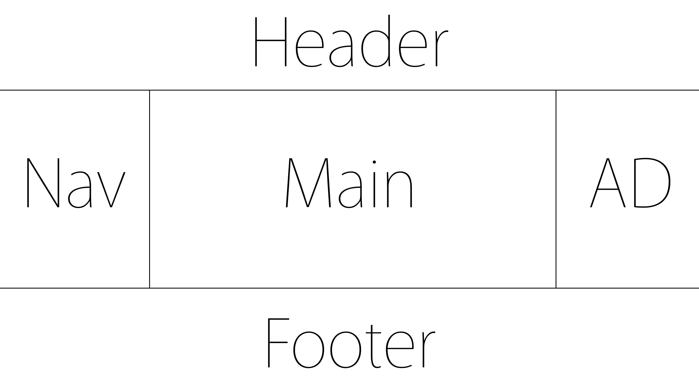

# fds0123

---

# 10:00-10:30 activity

/본인이 사용하는 프로그램 언어에 대한 당위성이 필요하다./

## Learn
https://www.inflearn.com/
https://www.udemy.com/

## Sass
[Sass guide](https://sass-guidelin.es/ko/#section-63)
[Sass why](https://windtale.net/blog/why-i-choose-sass/)
[Velopert.log](https://velopert.com/3447)
[Poiemaweb](http://poiemaweb.com/sass-basics)

---
WAI-ARIA

---

# 10:30-11:30

## float: 

## display:flex
	flex-direction:
    flex-basis:
    flex-shrink:
    

---
# 11:50-13:00 WAI ARIA

공지사항
목록
더보기
 
자료실
목록 
더보기

tapindex:
time:

ui: 
ux:

키보드 포커싱을 받을 수 있는 태그와 프로퍼티의 종류는 무엇이 있을까?

---

# WCAG - WAI ARIA

## 목적
역할('Role') 속성('property') 상태정보('state')를 추가 할 수 있다.

## Role
- 특정 'element' 에 역할을 정의한다 
- 역할을 부여하여 사용자에게 정보를 제공 
- 역할은 동적으로 변경 할 수 없다.

button은 브라우져마다 환경이 다르다 그렇기 때문에 div .button

요소가 기본적으로 갖고있는 특징이나 상황
속성과 상태는 아리아 접두어를 가진다
상태는 요소의 상황을 나타내므로 애플리케이션을 실행한다.

html 5 이전엔 이텔릭체가 의미를 가지고 있지 않았으나 
html 5 이후에 인용문이라는 의미가 추가되었다.

딤드된 상태

---

css multiline ellipsis