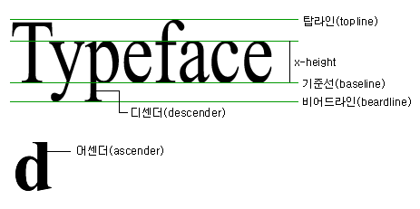

# fds0124

##오전수업 (10:30-13:00)

> IR 기법 
> Sprite 배경이미지

## 웹 접근성(web accessibility) 
장애를 가진 사람과 장애를 가지지 않은 사람 모두가 웹사이트를 이용할 수 있도록 하는 방식을 의미한다. 사이트가 정해진 규정에 맞게 설계되어 있을때 사용자는 정보와 기능에 동등하게 접근할 수 있다.

시각, 운동성, 청각, 발작, 인지 장애등을 고려하여 설계해야 한다.

&lt; p &gt; &lt; /p &gt; end-tag 사용
&lt; p &gt;&lt; a &gt; &lt; /p &gt; &lt; /a &gt; 부모와 자식관계를 지킨다.
&lt; p class="bax1" class="box2" &gt; Class 중복 x
&lt; tag id="#" &gt; id 속성 중복사용 x

---

## IR(Image Replacement)

웹접근성을 준수하기 위한 필수 사항 중 하나는 이미지에 적절한 대체 텍스트를 제공하는 것입니다. 일반적으로 HTML element 를 사용할 때 alt="" 로 대체 텍스를 제공합니다. 

link, button 등의 control element에는 alt="" 로 대체 텍스를 제공하는 것이 적합하다.

그러나 복합적인 이유로 공지사항 및 안내문을 텍스트가 아닌 이미지로 게시해야 할 때 또는 스크린리더 사용자에게 특정 이미지에 대한 추가 정보를 제공해야 할 때, 이미지를 대체 텍스트를 제공하는 것을 IR이라고 한다.

---
## IR을 잘못 사용하는 대표적 예시
- CSS 
> visibility: hidden
> display: none

## 올바른 IR기법의 대표적인 예시1

> text-indent

text-indent의 속성 값에 음수값을 입력하면, 이미지가 로드되지 않았을 때 텍스트를 보고 콘텐츠에 내용을 확인해야 하지만 화면상에 표시되지않아 확인할 수 없고, 위치값을 추적하는 과정에서 성능저하가 일어나게 됩니다.

---
## 올바른 IR기법의 대표적인 예시2
- CSS
>left/right
>height/width 
>overflow: hidden
>posion: absoute

---

## 위치속성과 overflow:hidden을 이용한 IR기법
> 'content-box(텍스트가 위치한)'span,div element를 디스플레이 해상도 보다 낮은 음수값을 부여해서 위치를 옮기고, height와 width 를 이용해 1px 정도의 크기로 만들고, overflow: hidden과 posion: absoute로 화면 상에서 숨기는 방식으로 사용합니다.

## height=0/width=0을 이용한 IR기법
> 'content-box(텍스트가 위치한)'에 height=0, width=0 을 지정하는 방법입니다. 
1. background img를 지정한다.
2. 'content-box'의 height=0, width=0 을 지정한다.

---

## z-index를 활용한 IR기법
> 이미지의 대체 텍스트에 z-index:음수값 값을 부여하는 방식입니다. 
> position property를 사용해서 디바이스의 사양에 따라 성능에 영향을 줄 수도 있다.

#Title  ARIA-label

---

# box-sizing	
>"content-box" default 
>"padding-box"
>"border-box"

---
# box-sizing
## "content-box" 
>- 기본값 (CSS Standard default)
>- width*height에 'content'가 포함되고,
>  'padding, border, margin'은 포함되지 않는다.

## "padding-box"
>- width*height에 'content, padding'이 포함되고, 'border, margin'은 포함되지 않는다.

## "border-box"
>- width*height에 'content, padding, border'이 포함되고, 'margin'은 포함되지 않는다.
---
# box-sizing
## 주의사항
box-sizing property 은 CSS inherit(상속)되지 않는다.
IE8~, Chorme 10~, Firefox 29~ 에서 지원한다.
모바일에선 Safari, Android 2.1 ~ (-webkit prefix-), Android 4.0 ~ 에서 지원한다.
padding-box property는 firefox에서 지원한다.

---

line height

---
# block & inline

## black 요소
address
article
aside
audio
blockquote
canvas
dd
div
dl
fieldset
figcaption

---

## black 요소
figure
footer
form
h1
h2
h3
h4
h5
h6
header
hgroup

---

## black 요소
hr
noscript
ol
output
p
pre
section
table
tfoot
ul
video
---

## inline 요소

a
abbr
acronym
b
bdo
big
br
button
cite
code

---

## inline 요소
dfn
em
i
img
input
kbd
label
map
object
q

---

## inline 요소
samp
small
script
select
span
strong
sub
sup
textarea
tt
var

---

### 대표적인 블록 요소 
>p
>h1
>blockquote
>li
>ul ol
>div

### 대표적인 인라인 요소
>a
>strong
>em
>span

---

posion:absolute 적용전 inline?

---

# font-structure

---

## 강조 (strong-굵게 em-기울임) 
&lt; strong &gt; &lt; em &gt;
## Presentation tag (b-볼드체 i-이테릭체)
&lt; b &gt; &lt; i &gt;

## 영문 표기시 
1. KDB BANK :screen reader 음성 전달력이 저하된다.
2. K.D.B BANK :screen reader 음성 전달력이 상향된다.

---

form
select 
option 

clip 
clip-path

vertical-align: 
text-align:
---

inspector

---

# css 
>-animation
>-transition
>-transform

---

# box-model

## width: auto;
inline element를 제외한 모든 elememt에 적용가능하다. element의 종류에 따라 기준이 다르게 적용되고 위치 및 float에 따라서 다르게 적용된다. 'hight'와 독립적으로 사용되고 default (기본값)은 width:auto 이다.

- case
>left: auto, right: auto, width: auto
>- 블록박스를 제외한 모든 박스모델이 자동 축소된다.

>left: 0, right: 0, width: auto
>- 블록 박스, 절대 박스는 자동으로 확대된다.

>width: 100% 
>- table에 padding, border ... 

---

# Vertical-align 
inline element, inline-block element 의 수직 정렬을 위해 사용한다.
block element에는 영향을 미치지 않는다. table-cell의 수직정렬은 예외이다.

## Strut
부모 요소의 font-size와 line-height 속성을 상속 받은 width가 0인 가상의 박스 

baseline

---
# Vertical-align 
- inline inline-block 에서 적용된다. 즉 div(block element)에서는 적용되지 않는다.
- 요소 자체만을 정렬하고, 내용에는 영향을 미치지 않는다.
- vertical-align은 inline 요소가 여럿이 있을 때, 다른 인라인 요소에 상대적으로 정렬하기 때문에, 설정값(크기와 위치)에 따라서 설정에 영향을 받는다.
- table-call에 vertical-align을 적용할 때는 내용에도 영향을 끼친다.

inline: baseline/sub/super/text-top/text-bottom/middle/top/bottom/(px, cm, em)/%

table cell:top/middle/bottom 
>- 음수값을 사용할 수 있다.