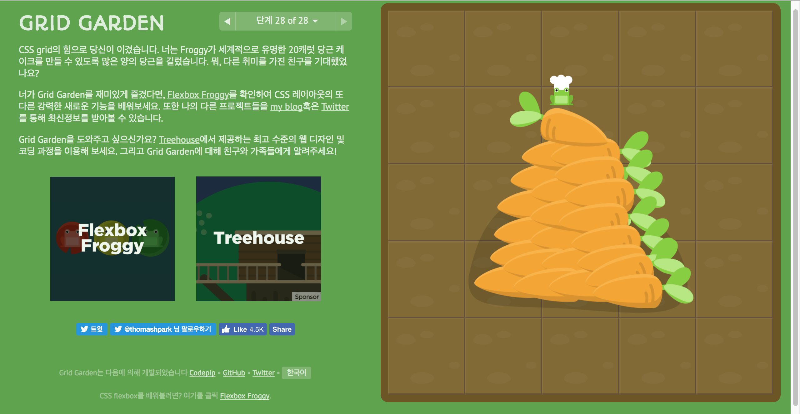

# fds0125

|                | block element | inline element |
| -------------- | ------------- | -------------- |
| text-align     | o             | o              |
| vertical-align | x             | ?              |

---

.fovorite

	h2 {인기} span {사이트}
	ol
		li {text} em. up {상승} 
	    li {text} em. down {하락}
	    li {text} em. stop {멈춤}
	a {더보기}

---

line-height
display:flex
dloat position

---

CSS text-transform Property
>none
>capitalize
>uppercase	
>lowercase
>initial	
>inherit	

CSS position:sticky

---

article .slogan
	h2
		title 
		ir
	p
		q {text}

---

&lt; blockquote &gt; site="출처"
&lt; q &gt; site="출처"

---
## footer
1.로고|a>img div.footerlogo>img
2.사이트 이용안내 링크|ul>li*5>a
3.주소|address>span*3
4.저작권|p div.copyright
5.기술(이미지)|div>img*2{alt}

address (본문이 아닌 푸터에만 사용한다.)
---
footer
940px

---

# Grid
[Grid-Game](http://cssgridgarden.com/#ko)

---

# Table
